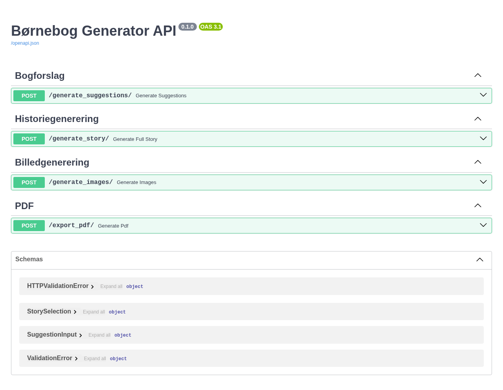
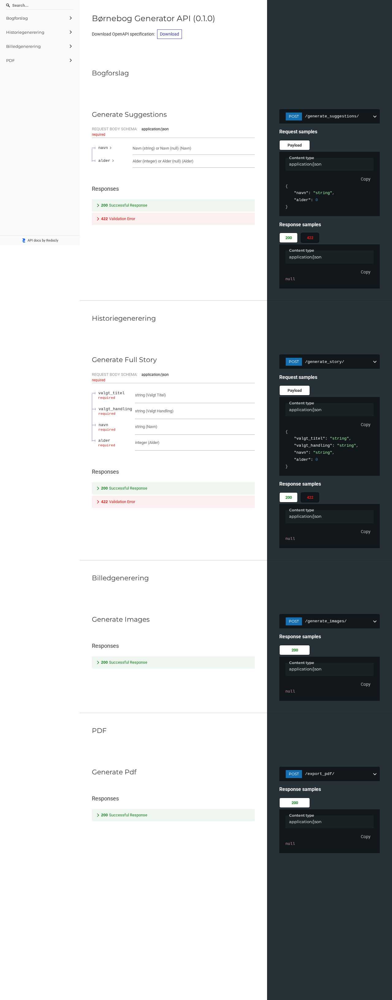

# Børnebog Generator

[](https://github.com/joachimth/storybook/actions/workflows/ci.yml)

Generer personlige, trykklar børnebøger i akvarelstil vha. GPT-4 og DALL-E. Output: 15×15 cm PDF klar til tryk hos Pixum (softcover).

## Funktioner

- **Forslag** - GPT-4 genererer 3 historieforslag ud fra barnets navn og alder
- **Historie** - fuld 14-siders tekst genereret og gemt som JSON
- **Billeder** - DALL-E genererer et akvarelillustration pr. side (1024×1024, upscalet til 1772×1772 px / 300 DPI)
- **PDF** - tekst composites ned på billederne og eksporteres som 150×150 mm PDF
- **GUI** - Tkinter-frontend til hele flowet uden terminal

## Screenshots

### API Dokumentation (Swagger UI)


### ReDoc


## Krav

- Python 3.10+
- OpenAI API-nøgle med adgang til GPT-4 og DALL-E

## Kom i gang

```bash
# 1. Klone repo
git clone https://github.com/joachimth/storybook.git
cd storybook

# 2. Installer afhængigheder
pip install -r requirements.txt

# 3. Sæt API-nøgle
cp .env.example .env
# Rediger .env og indsæt din OPENAI_API_KEY

# 4. Start backend
uvicorn app.main:app --reload

# 5. Start GUI (separat terminal)
python gui.py
```

## Brug

1. Indtast barnets navn og alder i GUI'en
2. Klik **"1. Hent forslag"** - vælg en historie
3. Klik **"2. Generér historie"** - teksten skrives og gemmes
4. Klik **"3. Generér billeder"** - DALL-E genererer 14 illustrationer (tager ~5-10 min)
5. Klik **"4. Eksportér PDF"** - PDF gemmes i `output/`

## Konfiguration

Alle indstillinger i `config.yaml`. Secrets sættes via miljøvariabler (se `.env.example`):

| Variabel | Beskrivelse |
|---|---|
| `OPENAI_API_KEY` | OpenAI API-nøgle (påkrævet) |
| `DEFAULT_NAME` | Standardnavn til test |

| config.yaml-nøgle | Standard | Beskrivelse |
|---|---|---|
| `model` | `gpt-4` | GPT-model til tekst |
| `default_pages` | `14` | Antal sider |
| `dpi` | `300` | DPI til billedoutput |
| `pdf_size_mm` | `150` | PDF-størrelse (mm) |

## Projektstruktur

```
storybook/
├── app/
│   ├── config.py          # Konfigurationsindlæsning + env-overrides
│   ├── main.py            # FastAPI app
│   ├── models.py          # Pydantic modeller
│   └── endpoints/
│       ├── suggestions.py # POST /generate_suggestions
│       ├── story.py       # POST /generate_story
│       ├── images.py      # POST /generate_images
│       └── pdf.py         # POST /export_pdf
├── assets/fonts/          # DejaVuSans (Unicode PDF-font)
├── gui.py                 # Tkinter desktop-app
├── capture-screenshots.py # Playwright screenshot-automation
├── config.yaml            # Appkonfiguration
└── requirements.txt
```

## API Endpoints

| Method | Path | Beskrivelse |
|---|---|---|
| POST | `/generate_suggestions` | Returnerer 3 historieforslag |
| POST | `/generate_story` | Genererer fuld historie og gemmer JSON |
| POST | `/generate_images` | Genererer DALL-E billeder pr. side |
| POST | `/export_pdf` | Bygger trykklar PDF |

Fuld dokumentation: `http://localhost:8000/docs`
